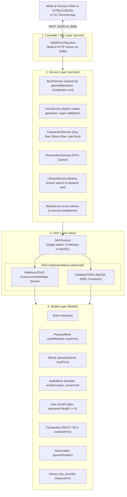

# 📚 Smart Library System — Complete Developer & Architecture Guide (Day 1 to 5)

Welcome to the backend architecture for the **Smart Library System**!  
This guide documents the entire Day 1 to Day 5 syllabus implementation and provides step-by-step instructions for adding new features, services, database queries, and REST endpoints.

---

## 🗺️ Syllabus Roadmap Compliance (Day 1 to 5)

| Syllabus Phase | Key Deliverables & Classes | Implemented Features |
| :--- | :--- | :--- |
| **Day 1: OOP Models & Validation** | `User`, `Book`, `PhysicalBook`, `EBook`, `AudioBook`, `Borrowable`, `DigitalAccessible`, `Transaction`, `TransactionType`, `Reservation`, `Library` | • Polymorphic rates: Physical (₹20/d), AudioBook (₹15/d), E-Book (₹10/d)<br>• Email regex validation & password length check (>= 6 chars)<br>• Dual Transaction types: `RENT` and `BUY`<br>• Strict account model: Root Admin only; Readers generated by Admin |
| **Day 2: Persistence & DAOs** | `DBConnection`, `DAOFactory`, `BookDAO`, `UserDAO`, `TransactionDAO`, `ReservationDAO`, `LibraryDAO`, `schema.sql` | • Zero-setup In-Memory mode + MySQL database mode<br>• Thread-safe `ConcurrentHashMap` with O(1) lookups<br>• Fully prepared JDBC statements |
| **Day 3: Search & Sort** | `BookService`, `LibraryService`, `InMemoryLibraryDAO` | • Nearby libraries search by city or pincode, sorted by `distanceKm`<br>• Book search across Title, Author, Genre, and ID<br>• Java `Comparator` price and title sorting |
| **Day 4: Transactions & Queue** | `TransactionService`, `InMemoryReservationDAO` | • **Buy Flow**: Permanent purchases with copy count decrement<br>• **Return Flow**: Automated ₹15/day late fee calculation<br>• **FIFO Queue (`Queue<Reservation>`)**: Next reader in queue automatically gets returned books |
| **Day 5: Full UI & Admin Desk** | `HttpServerApp`, `index.html`, `style.css`, `app.js` | • Ultra-clean White & Premium SaaS UI (Apple/Stripe aesthetic)<br>• Admin Reader Account Generator with auto-ID and password generator<br>• AudioBook streaming player modal<br>• Live stats: Total books, active loans, and sales revenue |

---

## 🏗️ 1. High-Level Architecture



---

## 🔐 2. Strict Account Architecture

Per project specification:
1. **Pre-Seeded Accounts:**
   - **Root Admin Only**:
     - User ID: `admin`
     - Password: `admin123`
     - Role: `ADMIN`
2. **Reader Accounts:**
   - There are **no hardcoded reader profiles**.
   - The Administrator generates Reader IDs and passwords directly from the **Admin Desk** (`/api/admin/create-reader`).
   - Email format is validated using regex: `^[a-zA-Z0-9_+&*-]+(?:\.[a-zA-Z0-9_+&*-]+)*@(?:[a-zA-Z0-9-]+\.)+[a-zA-Z]{2,7}$`
   - Password must be at least 6 characters.
   - Readers can only log into their profiles using credentials generated by the Admin!

---

## ⚡ 3. Quick Run & Build Instructions

### Linux & macOS:
```bash
./run.sh
```
Or manually:
```bash
javac -cp "lib/*" -d bin $(find src -name "*.java")
java -cp "bin:lib/*" Main 8080
```

### Windows:
```cmd
run.bat
```

Once running, open: **`http://localhost:8080`** in your browser.

---

## 📡 4. REST API Endpoint Reference

| Method | Endpoint | Description | Payload / Query Params |
| :--- | :--- | :--- | :--- |
| `GET` | `/api/health` | Health & active storage mode | None |
| `POST` | `/api/auth/login` | Authenticate Admin or Reader | `{"userId": "admin", "password": "..."}` |
| `GET` | `/api/books` | Query books with search & sort | `?query=java&type=AUDIOBOOK&sort=price_asc` |
| `POST` | `/api/books` | Add new Physical/E-Book/AudioBook | JSON Book Object |
| `POST` | `/api/borrow` | Rent a book for N days | `{"userId": "...", "bookId": "...", "days": 7}` |
| `POST` | `/api/buy` | Buy a book permanently | `{"userId": "...", "bookId": "..."}` |
| `POST` | `/api/return` | Return rented book & calculate fine | `{"transactionId": "TX-1001"}` |
| `POST` | `/api/reserve` | Enter FIFO reservation queue | `{"userId": "...", "bookId": "..."}` |
| `GET` | `/api/libraries/nearby` | Find libraries by city/pincode | `?query=Delhi` or `?query=110001` |
| `POST` | `/api/admin/create-reader` | Admin creates Reader account | `{"userId": "...", "name": "...", "email": "...", "password": "..."}` |
| `GET` | `/api/admin/readers` | List all readers created by Admin | None |
| `DELETE`| `/api/admin/readers/delete` | Delete reader account | `?userId=RDR-1001` |
| `GET` | `/api/stats` | System KPI metrics & revenue | None |
| `POST` | `/api/config/db` | Switch between In-Memory and MySQL | `{"enable": true}` |

---

## 🛠️ 5. How to Add a New Feature (For Partner)

1. **Add Model / Entity:** Create or extend POJOs in `src/Model/`.
2. **Define DAO Interface:** In `src/dao/`, add required methods.
3. **Implement DAO:**
   - In-memory implementation in `src/dao/impl/InMemory<Entity>DAO.java` using `ConcurrentHashMap`.
   - MySQL JDBC implementation in `src/dao/impl/Database<Entity>DAO.java` using `DBConnection.getConnection()`.
4. **Register in DAOFactory:** Update `src/dao/DAOFactory.java`.
5. **Add Service:** Add business logic in `src/service/<Entity>Service.java`.
6. **Expose REST API Endpoint:** Register a route in `src/server/HttpServerApp.java`.
7. **Connect to Web UI:** Add HTML inputs in `src/web/index.html` and fetch logic in `src/web/app.js`.

---

## 🗄️ 6. MySQL Database Setup

1. Make sure MySQL server is running on `localhost:3306`.
2. Run `schema.sql` into MySQL:
   ```bash
   mysql -u root -p < schema.sql
   ```
3. Update connection credentials in `src/util/DBConnection.java` (default is `root` / `root123` or your password).
4. Click **"Switch to MySQL Mode"** in the top navigation or call `DAOFactory.setUseDatabase(true)`.
